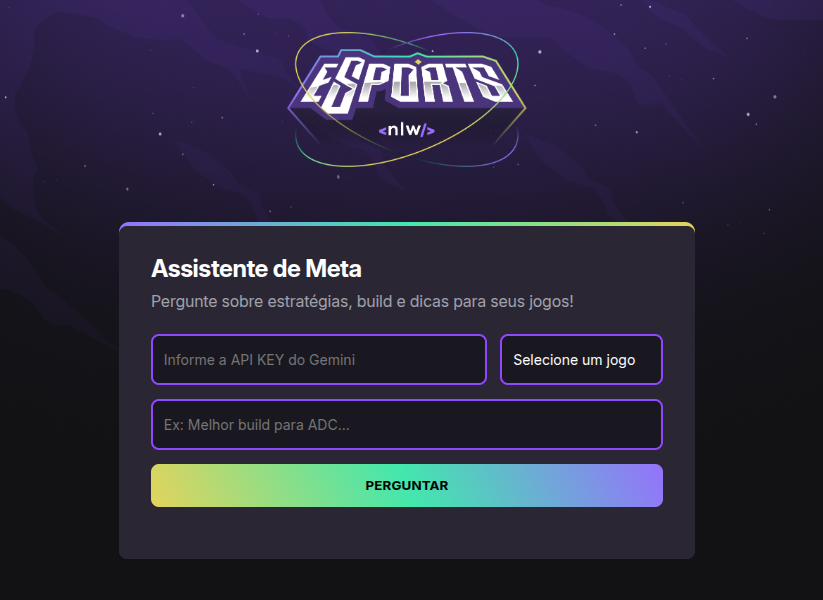

# 🤖 NLW Agents - Assistente de Meta para Jogos



---

## 💻 Sobre o Projeto

O **Assistente de Meta** é uma aplicação web desenvolvida durante a **Trilha Iniciante da NLW Agents**, evento promovido pela [Rocketseat](https://www.rocketseat.com.br/). O projeto tem como objetivo funcionar como um assistente de IA especializado em jogos competitivos, fornecendo dicas e estratégias para jogos como GTA, COD-Mobile e God of War.

A aplicação integra-se diretamente com a API do Google Gemini para gerar respostas em tempo real, utilizando técnicas de engenharia de prompt para garantir que as informações sejam precisas e relevantes para o contexto do jogador.

---

## ✨ Funcionalidades

- **Seleção de Jogo:** Permite ao usuário escolher o jogo para o qual deseja a dica.
- **Interação com IA:** Envia a pergunta do usuário para a API do Google Gemini através de uma requisição `fetch`.
- **Engenharia de Prompt:** O prompt enviado à IA é estruturado para definir um papel de especialista, regras de comportamento e o contexto do jogo.
- **Renderização de Markdown:** As respostas da IA, formatadas em Markdown, são convertidas para HTML e exibidas de forma legível na tela usando a biblioteca Showdown.js.

---

## 🚀 Como Executar

Para executar este projeto localmente, siga os passos abaixo.

### Pré-requisitos

-   [Git](https://git-scm.com/) instalado.
-   Um servidor local. Recomenda-se a extensão **[Live Server](https://marketplace.visualstudio.com/items?itemName=ritwickdey.LiveServer)** para o VS Code.
-   Uma **API Key** do Google Gemini. Você pode obtê-la gratuitamente no **[Google AI Studio](https://aistudio.google.com/app/apikey)**.

### Passos

1.  **Clone o repositório:**
    ```bash
    git clone https://github.com/PArthur006/NLW-Agents-Iniciante.git 
    ```
    2.  **Navegue até a pasta do projeto:**
    ```bash
    cd NLW-Agents-Iniciante
    ```

3.  **Abra com o Live Server:**
    -   Abra a pasta do projeto no VS Code.
    -   Clique com o botão direito no arquivo `index.html`.
    -   Selecione a opção "Open with Live Server".

4.  **Utilize a aplicação:**
    -   O site será aberto no seu navegador.
    -   Insira sua API Key do Google Gemini no campo correspondente.
    -   Selecione o jogo, faça sua pergunta e receba a resposta da IA!

---

## 🧠 Aprendizados

Este projeto foi uma excelente oportunidade para solidificar e aplicar conceitos essenciais do desenvolvimento web:

* **Fundamentos da Web:** Reforcei a base de como a web funciona (HTTP, DNS) e o papel fundamental do HTML para estruturar o conteúdo e do CSS para estilizar as páginas, criando uma interface agradável e responsiva.

* **JavaScript e DOM:** Aprofundei os conhecimentos em JavaScript para adicionar interatividade real à aplicação. O principal aprendizado foi a manipulação do DOM para criar uma experiência de usuário dinâmica, como a validação de formulários e a atualização de elementos da página em resposta às ações do usuário.

* **Inteligência Artificial e APIs:** O grande desafio foi a integração com uma IA. Aprendi sobre LLMs, a importância da **Engenharia de Prompt** para obter respostas de qualidade e como consumir APIs externas de forma assíncrona usando a `fetch` API do JavaScript.

---
